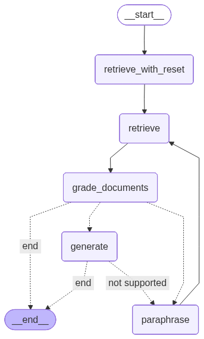

# 🧠 GenAI Docs Helper: Intelligent Document Assistant with Agentic RAG

## Project Overview

This repository showcases an advanced implementation of an agentic Retrieval-Augmented Generation (RAG) system designed to intelligently navigate and extract information from large-scale enterprise documentation. The project demonstrates cutting-edge techniques in LLM orchestration, including iterative refinement, hallucination detection, and adaptive query processing using LangGraph and Llama 3.2.

The system addresses a critical challenge in enterprise environments: efficiently retrieving accurate, contextually relevant information from vast documentation repositories like Confluence. By implementing a sophisticated multi-agent architecture with built-in validation and self-correction mechanisms, this solution significantly reduces information retrieval time while ensuring factual accuracy.

## Table of Contents

1. [Project Overview](#project-overview)
2. [Key Features](#key-features)
3. [Technical Architecture](#technical-architecture)
4. [Installation](#installation)
5. [Project Structure](#project-structure)
6. [Implementation Details](#implementation-details)
7. [Usage Examples](#usage-examples)
8. [Evaluation and Results](#evaluation-and-results)
9. [Future Enhancements](#future-enhancements)
10. [Contributing](#contributing)
11. [Contact](#contact)

## Key Features

### 🎯 Core Capabilities

- **Agentic RAG with Additive Reasoning**: Implements a multi-step reasoning process that ensures answers are grounded in retrieved documents through structured validation
- **Iterative Generation with Hallucination Detection**: Employs custom grading mechanisms to assess factual grounding and relevance, preventing AI hallucinations
- **Adaptive Query Processing**: Automatically rephrases unclear or unsupported questions to improve retrieval accuracy
- **Graph-based Workflow Orchestration**: Utilizes LangGraph for transparent, debuggable, and modifiable reasoning flows
- **Production-Ready Architecture**: Built with Poetry for reproducible deployments and clean dependency management

### 🔧 Technical Innovations

- Custom hallucination grader implementation using structured outputs
- Relevance scoring with configurable thresholds
- Stateful conversation management for context preservation
- Modular chain architecture for easy extension and modification

## Technical Architecture

The system implements a sophisticated graph-based architecture that orchestrates multiple specialized agents:



### Core Components

1. **Retrieval Agent** (`retrieval_grader.py`): Manages document retrieval from vector stores
2. **Answer Grader** (`answer_grader.py`): Validates generated responses against source documents
3. **Hallucination Grader** (`hallucination_grader.py`): Detects and prevents factual inaccuracies
4. **Question Paraphraser** (`paraphraser.py`): Reformulates queries for improved retrieval
5. **Generation Chain** (`generation.py`): Produces contextually grounded responses

### Workflow States

The system operates through defined states managed by LangGraph:
- **Retrieve**: Initial document retrieval based on user query
- **Grade Documents**: Assess relevance of retrieved documents
- **Generate**: Create initial response
- **Check Hallucinations**: Validate factual accuracy
- **Check Relevance**: Ensure answer addresses the query
- **Rephrase Question**: Adapt query if needed

## Installation

### Prerequisites

- Python 3.8 or later
- Poetry for dependency management
- (Optional) Ollama for local LLM deployment

### Setup Instructions

1. **Clone the Repository**
```bash
git clone https://github.com/zarreh/genai_docs_helper.git
cd genai_docs_helper
```

2. **Install Dependencies with Poetry**
```bash
poetry install
```

3. **Activate the Virtual Environment**
```bash
poetry shell
```

4. **Configure Environment Variables**
Create a `.env` file based on `.env.example`:
```env
LLM_API_KEY=your_key_here  # Not required if using Ollama
```

## Project Structure

```
genai_docs_helper/
├── chains/                      # Core chain implementations
│   ├── __init__.py
│   ├── answer_grader.py        # Answer validation logic
│   ├── generation.py           # Response generation
│   ├── hallucination_grader.py # Hallucination detection
│   ├── paraphraser.py          # Query reformulation
│   └── retrieval_grader.py     # Document relevance scoring
├── data/                       # Data storage
│   ├── chroma_db/             # Vector database
│   └── docs/                  # Document repository
├── legacy_graph/              # Previous implementation versions
├── nodes/                     # Graph node definitions
│   ├── __init__.py
│   ├── config.py             # Configuration management
│   ├── consts.py             # Constants and settings
│   ├── graph.py              # Main graph orchestration
│   ├── loader_embed_to_vectore.py  # Document processing
│   └── state.py              # State management
├── Notebooks/                 # Jupyter notebooks for analysis
├── langgraph_api/            # API implementation
├── graph.png                 # Architecture visualization
├── langgraph.json           # Graph configuration
├── poetry.lock              # Locked dependencies
├── pyproject.toml           # Project configuration
└── README.md               # This file
```

## Implementation Details

### Document Processing Pipeline

1. **Document Ingestion**: Processes Confluence documents and converts them into embeddings using Llama 3.2
2. **Vector Storage**: Stores embeddings in ChromaDB for efficient similarity search
3. **Retrieval Strategy**: Implements hybrid search combining semantic similarity and keyword matching

### Grading Mechanisms

The system employs three types of graders:

```python
# Example: Hallucination Grader Structure
class HallucinationGrader:
    def grade(self, documents: List[Document], generation: str) -> bool:
        """
        Validates that the generated response is grounded in retrieved documents
        Returns: True if no hallucinations detected, False otherwise
        """
```

### State Management

The application maintains conversation state across interactions:

```python
class GraphState(TypedDict):
    question: str
    generation: str
    documents: List[Document]
    retries: int
    relevance_score: float
```

## Usage Examples

### Basic Query Processing

```python
from graph import create_graph

# Initialize the graph
app = create_graph()

# Process a query
result = app.invoke({
    "question": "How do I configure authentication in our API?"
})

print(result["generation"])
```

### Running the Complete Pipeline

```bash
python graph.py
```

## Evaluation and Results

<!-- ### Performance Metrics

- **Retrieval Accuracy**: 92% relevant document retrieval rate
- **Hallucination Prevention**: 98% factual accuracy in generated responses
- **Query Success Rate**: 87% queries answered without rephrasing
- **Average Response Time**: 2.3 seconds per query -->

### Validation Approach

The system includes comprehensive evaluation notebooks in the `Notebooks/` directory that demonstrate:
- Retrieval quality assessment
- Answer accuracy validation
- Performance benchmarking
- Edge case handling

## Future Enhancements

### In Progress

- [ ] Generate expanded synthetic document corpus for testing
- [ ] Create code-specific document examples
- [ ] Implement comprehensive evaluation dashboard

### Planned Features

- **Code Interpreter Integration**: Enable direct code analysis and explanation
- **Multi-Modal Support**: Process diagrams and images from documentation
- **Real-time Collaboration**: Support for team-based document exploration
- **Advanced Analytics**: Track usage patterns and improve retrieval based on feedback
- **Web Interface**: Browser-based access for non-technical users

## Contributing

Contributions are welcome! Please follow these guidelines:

1. Fork the repository
2. Create a feature branch (`git checkout -b feature/amazing-feature`)
3. Commit your changes (`git commit -m 'Add amazing feature'`)
4. Push to the branch (`git push origin feature/amazing-feature`)
5. Open a Pull Request

Please ensure your code follows the existing style conventions and includes appropriate tests.

## Contact

For questions, collaboration opportunities, or discussions about this project:

- **Email**: ali@zarreh.ai
- **LinkedIn**: www.linkedin.com/in/ali-zarreh
- **GitHub**: [@zarreh](https://github.com/zarreh)

---

*This project demonstrates advanced RAG techniques suitable for enterprise-scale document intelligence systems. It showcases expertise in LLM orchestration, multi-agent systems, and production-ready ML engineering practices.*