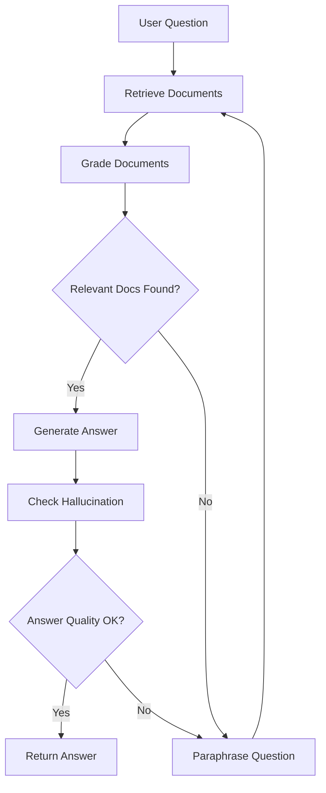

# GenAI Docs Helper 🤖📚

An intelligent document retrieval and question-answering system powered by LangChain and LangGraph. This project demonstrates advanced RAG (Retrieval-Augmented Generation) techniques with production-ready features including caching, performance monitoring, and intelligent retry mechanisms.

## 🌟 Features

- **Intelligent Document Retrieval**: Multi-strategy retrieval system with fast, standard, and comprehensive paths
- **Advanced RAG Pipeline**: Implements document grading, answer validation, and hallucination detection
- **Performance Optimization**: 
  - Redis/Memory dual-layer caching
  - Parallel document retrieval
  - Early stopping mechanisms
  - Batch processing for efficiency
- **Production-Ready Monitoring**: Comprehensive logging and performance metrics
- **Flexible Architecture**: Modular design with LangGraph for complex workflows
- **Multiple LLM Support**: Compatible with OpenAI and Ollama models

## 🏗️ Architecture



## 🚀 Quick Start

### Prerequisites

- Python 3.8+
- Poetry for dependency management
- Redis (optional, for caching)
- Ollama or OpenAI API key

### Installation

```bash
# Clone the repository
git clone https://github.com/yourusername/genai_docs_helper.git
cd genai_docs_helper

# Install dependencies
poetry install

# Set up environment variables
cp .env.example .env
# Edit .env with your API keys
```

### Data Preparation

```bash
# Load and embed documents into vector store
make ingest
```

### Running the Application

```bash
# Run the main graph workflow
make run

# Or use LangGraph Studio for interactive development
make graph
```

## 📁 Project Structure

```
genai_docs_helper/
├── nodes/              # Core processing nodes
│   ├── retrieve.py     # Document retrieval with multiple strategies
│   ├── grade_documents.py  # Relevance assessment
│   ├── generate.py     # Answer generation
│   └── paraphrase.py   # Query reformulation
├── chains/             # LangChain components
│   ├── generation.py   # Answer generation chain
│   ├── hallucination_grader.py  # Hallucination detection
│   └── retrieval_grader.py      # Document relevance grading
├── cache/              # Caching system
│   └── query_cache.py  # Dual-layer cache implementation
├── monitoring/         # Performance monitoring
│   └── performance_monitor.py  # Metrics collection
├── state.py           # Graph state management
├── graph.py           # Main workflow definition
└── config.py          # Configuration settings
```

## 🧪 Testing

```bash
# Run all tests
make test

# Run with coverage
make test-cov

# Run specific test file
make test-specific TEST=tests/unit/nodes/test_retrieve.py
```

## 📖 Documentation

```bash
# Generate HTML documentation
make docs

# Serve documentation locally
make docs-serve
```

## 🔧 Configuration

Key configuration options in `config.py`:

```python
# LLM Selection
LLM_TYPE = "ollama"  # or "openai"

# Performance Settings
ENABLE_CACHE = True     # Toggle caching
ENABLE_REDIS = False    # Use Redis (requires Redis server)
MAX_WORKERS = 5         # Parallel processing workers
BATCH_SIZE = 5          # Document grading batch size
```

## 📊 Performance Features

### 1. **Multi-Strategy Retrieval**
- **Fast Path**: Quick retrieval for time-sensitive queries (100-500ms)
- **Comprehensive Path**: Thorough search with query expansion
- **Fallback Mechanisms**: Graceful degradation on errors

### 2. **Intelligent Caching**
- Dual-layer cache (Redis + Memory)
- Automatic cache invalidation
- Cache hit rate monitoring

### 3. **Performance Monitoring**
- Request-level metrics tracking
- Bottleneck identification
- Detailed performance logs

## 🛠️ Advanced Usage

### Custom Document Loaders

```python
from genai_docs_helper.loader_embed_to_vectore import load_markdown_files

# Load your custom documents
docs = load_markdown_files("./path/to/docs")
```

### Using Different Embeddings

```python
from genai_docs_helper.config import EMBEDDING

# Configure in config.py
EMBEDDING = OllamaEmbeddings(model="llama3.2")
```

### Monitoring Performance

```python
from genai_docs_helper.monitoring import PerformanceMonitor

monitor = PerformanceMonitor()
monitor.start_request("req-123")
# ... operations ...
summary = monitor.end_request("req-123")
```

## 🤝 Contributing

1. Fork the repository
2. Create a feature branch (`git checkout -b feature/amazing-feature`)
3. Commit your changes (`git commit -m 'Add amazing feature'`)
4. Push to the branch (`git push origin feature/amazing-feature`)
5. Open a Pull Request

## 📝 License

This project is licensed under the MIT License - see the LICENSE file for details.

## 🙏 Acknowledgments

- Built with [LangChain](https://langchain.com/) and [LangGraph](https://github.com/langchain-ai/langgraph)
- Vector storage powered by [Chroma](https://www.trychroma.com/)
- LLM support for [OpenAI](https://openai.com/) and [Ollama](https://ollama.ai/)

## 📧 Contact

Your Name - your.email@example.com

Project Link: [https://github.com/yourusername/genai_docs_helper](https://github.com/yourusername/genai_docs_helper)