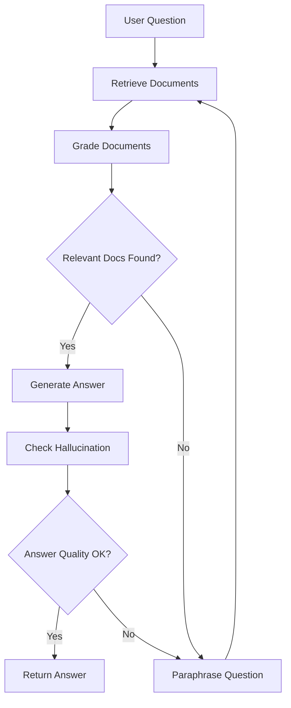

# GenAI Docs Helper 🤖📚

An intelligent document retrieval and question-answering system powered by LangChain and LangGraph. This project demonstrates advanced RAG (Retrieval-Augmented Generation) techniques with production-ready features including caching, performance monitoring, and intelligent retry mechanisms.

## 🌟 Features

- **Intelligent Document Retrieval**: Multi-strategy retrieval system with fast, standard, and comprehensive paths
- **Advanced RAG Pipeline**: Implements document grading, answer validation, and hallucination detection
- **Performance Optimization**: 
  - Redis/Memory dual-layer caching
  - Parallel document retrieval
  - Early stopping mechanisms
  - Batch processing for efficiency
- **Production-Ready Monitoring**: Comprehensive logging and performance metrics
- **Flexible Architecture**: Modular design with LangGraph for complex workflows
- **Multiple LLM Support**: Compatible with OpenAI and Ollama models

## 🏗️ Architecture



## 🚀 Quick Start

### Prerequisites

- Python 3.8+
- Poetry for dependency management
- Redis (optional, for caching)
- Ollama or OpenAI API key

### Installation

```bash
# Clone the repository
git clone https://github.com/yourusername/genai_docs_helper.git
cd genai_docs_helper

# Install dependencies
poetry install

# Set up environment variables
cp .env.example .env
# Edit .env with your API keys
```

### Data Preparation

```bash
# Load and embed documents into vector store
make ingest
```

### Running the Application

```bash
# Run the main graph workflow
make run

# Or use LangGraph Studio for interactive development
make graph
```

## 📁 Project Structure

```
genai_docs_helper/
├── nodes/                      # Core processing nodes
│   ├── __init__.py
│   ├── retrieve.py            # Multi-strategy document retrieval
│   ├── grade_documents.py     # Batch relevance assessment
│   ├── generate.py            # Answer generation with caching
│   ├── paraphrase.py          # Query reformulation
│   └── README.md              # Detailed node documentation
├── chains/                     # LangChain components
│   ├── __init__.py
│   ├── generation.py          # Answer generation chain
│   ├── retrieval_grader.py    # Single document relevance grading
│   ├── batch_grader.py        # Batch document grading
│   ├── hallucination_grader.py # Hallucination detection
│   ├── answer_grader.py       # Answer quality checker
│   ├── paraphraser.py         # Question paraphrasing
│   ├── query_expander.py      # Query expansion for better retrieval
│   ├── confidence_scorer.py   # Document confidence scoring
│   ├── document_reranker.py   # LLM-based document reranking
│   └── README.md              # Detailed chain documentation
├── cache/                      # Caching system
│   ├── __init__.py
│   ├── query_cache.py         # Dual-layer cache implementation
│   └── README.md              # Cache module documentation
├── monitoring/                 # Performance monitoring
│   ├── __init__.py
│   ├── performance_monitor.py # Metrics collection and analysis
│   └── README.md              # Monitoring documentation
├── utils/                      # Utility functions
│   ├── __init__.py
│   └── logging_config.py      # Centralized logging configuration
├── legacy_graph/               # Legacy implementation (reference)
│   ├── __init__.py
│   ├── app.py
│   ├── chain.py
│   └── main.py
├── tests/                      # Comprehensive test suite
│   ├── __init__.py
│   ├── conftest.py            # Shared test fixtures
│   ├── unit/                  # Unit tests
│   │   ├── nodes/             # Node-specific tests
│   │   │   ├── test_retrieve.py
│   │   │   ├── test_grade_documents.py
│   │   │   ├── test_generate.py
│   │   │   └── test_paraphrase.py
│   │   ├── chains/            # Chain-specific tests
│   │   ├── cache/             # Cache tests
│   │   │   └── test_query_cache.py
│   │   └── monitoring/        # Monitoring tests
│   │       └── test_performance_monitor.py
│   └── integration/           # Integration tests
│       └── test_workflow.py
├── docs/                       # Generated documentation (pdoc)
│   └── genai_docs_helper.html # Entry point for documentation
├── logs/                       # Application logs
│   └── performance/           # Performance metrics logs
├── state.py                    # Graph state management
├── graph.py                    # Main workflow definition
├── config.py                   # Configuration settings
├── consts.py                   # Constants and node names
├── loader_embed_to_vectore.py  # Document loading and embedding
├── Makefile                    # Build and run commands
├── pytest.ini                  # Test configuration
├── pyproject.toml             # Project dependencies
└── README.md                  # This file
```

## 🧪 Testing

The project includes a comprehensive test suite with unit and integration tests.

### Running Tests

```bash
# Run all tests
make test

# Run unit tests only
make test-unit

# Run integration tests only
make test-integration

# Run with coverage report
make test-cov

# Run tests in parallel (faster)
make test-parallel

# Run specific test file
make test-specific TEST=tests/unit/nodes/test_retrieve.py

# Run tests in watch mode
make test-watch
```

### Test Coverage

The test suite aims for 80%+ code coverage and includes:
- ✅ All node functions with edge cases
- ✅ Chain components and prompt engineering
- ✅ Cache operations with Redis fallback
- ✅ Performance monitoring functionality
- ✅ Error handling and recovery scenarios
- ✅ End-to-end workflow integration

View the coverage report:
```bash
make test-cov
open htmlcov/index.html  # View detailed HTML coverage report
```

## 📖 Documentation

### Generated Documentation

The project uses `pdoc` for automatic API documentation generation:

```bash
# Generate HTML documentation
make docs

# Serve documentation locally (http://localhost:8080)
make docs-serve

# Clean generated documentation
make docs-clean
```

### Module Documentation

Each major module includes its own README with detailed information:

- [**Nodes Module**](genai_docs_helper/nodes/README.md) - Core processing nodes documentation
- [**Chains Module**](genai_docs_helper/chains/README.md) - LangChain components documentation
- [**Cache Module**](genai_docs_helper/cache/README.md) - Caching system documentation
- [**Monitoring Module**](genai_docs_helper/monitoring/README.md) - Performance monitoring documentation

### API Documentation Structure

Once generated, the documentation includes:
- Complete API reference for all modules
- Type annotations and signatures
- Docstring documentation
- Source code browsing
- Cross-references between modules

Access the documentation at: `docs/genai_docs_helper.html`

## 🔧 Configuration

Key configuration options in `config.py`:

```python
# LLM Selection
LLM_TYPE = "ollama"  # or "openai"

# Performance Settings
ENABLE_CACHE = False    # Toggle caching (set to False for debugging)
ENABLE_REDIS = False    # Use Redis (requires Redis server)
MAX_WORKERS = 5         # Parallel processing workers
BATCH_SIZE = 5          # Document grading batch size

# Retrieval Settings
RETRIEVAL_CONFIGS = {
    "fast": {"k": 20, "fetch_k": 40},
    "standard": {"k": 50, "fetch_k": 100},
    "comprehensive": {"k": 100, "fetch_k": 200}
}
```

## 📊 Performance Features

### 1. **Multi-Strategy Retrieval**
- **Fast Path**: Quick retrieval for time-sensitive queries (100-500ms)
- **Comprehensive Path**: Thorough search with query expansion
- **Fallback Mechanisms**: Graceful degradation on errors

### 2. **Intelligent Caching**
- Dual-layer cache (Redis + Memory)
- Automatic cache invalidation
- Cache hit rate monitoring
- Question-specific cache keys

### 3. **Performance Monitoring**
- Request-level metrics tracking
- Bottleneck identification
- Detailed performance logs
- JSON-based log analysis

## 🛠️ Advanced Usage

### Custom Document Loaders

```python
from genai_docs_helper.loader_embed_to_vectore import load_markdown_files

# Load your custom documents
docs = load_markdown_files("./path/to/docs")
```

### Using Different Embeddings

```python
from genai_docs_helper.config import EMBEDDING

# Configure in config.py
EMBEDDING = OllamaEmbeddings(model="llama3.2")
```

### Monitoring Performance

```python
from genai_docs_helper.monitoring import PerformanceMonitor

monitor = PerformanceMonitor()
monitor.start_request("req-123")
# ... operations ...
summary = monitor.end_request("req-123")
```

### Analyzing Logs

```python
# Check logs directory
ls logs/

# View latest application log
tail -f logs/latest.log

# Analyze performance metrics
python -m genai_docs_helper.monitoring.analyze_logs
```

## 🤝 Contributing

1. Fork the repository
2. Create a feature branch (`git checkout -b feature/amazing-feature`)
3. Commit your changes (`git commit -m 'Add amazing feature'`)
4. Push to the branch (`git push origin feature/amazing-feature`)
5. Open a Pull Request

## 📝 License

This project is licensed under the MIT License - see the LICENSE file for details.

## 🙏 Acknowledgments

- Built with [LangChain](https://langchain.com/) and [LangGraph](https://github.com/langchain-ai/langgraph)
- Vector storage powered by [Chroma](https://www.trychroma.com/)
- LLM support for [OpenAI](https://openai.com/) and [Ollama](https://ollama.ai/)

## 📧 Contact

Ali Zarreh - ali@zarreh.ai

Project Link: [https://github.com/zarreh/genai_docs_helper](https://github.com/zarreh/genai_docs_helper)